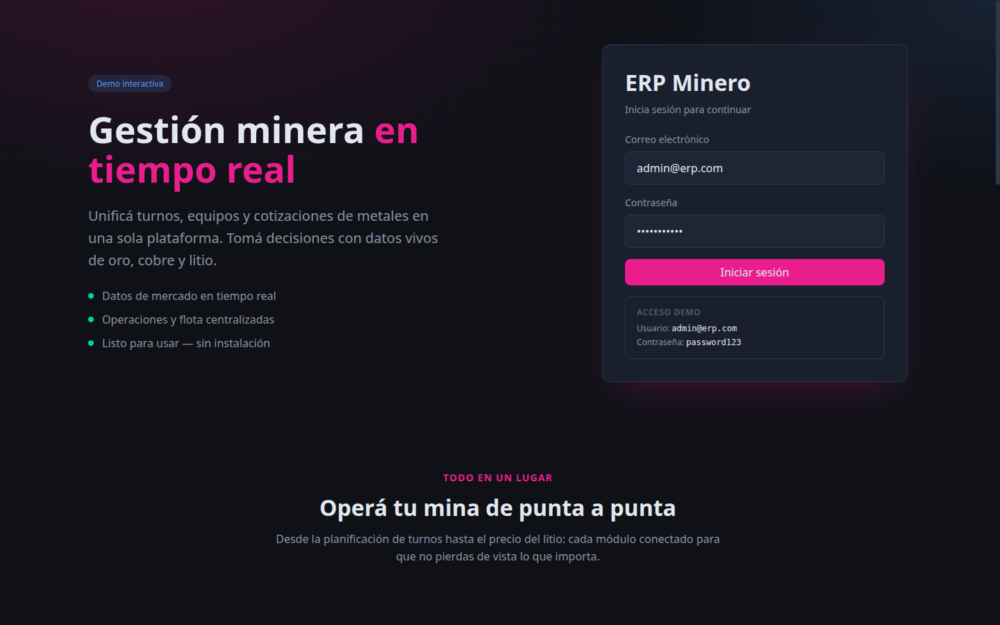
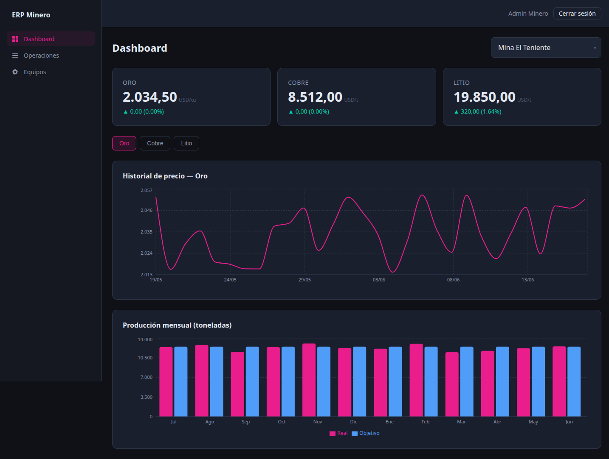
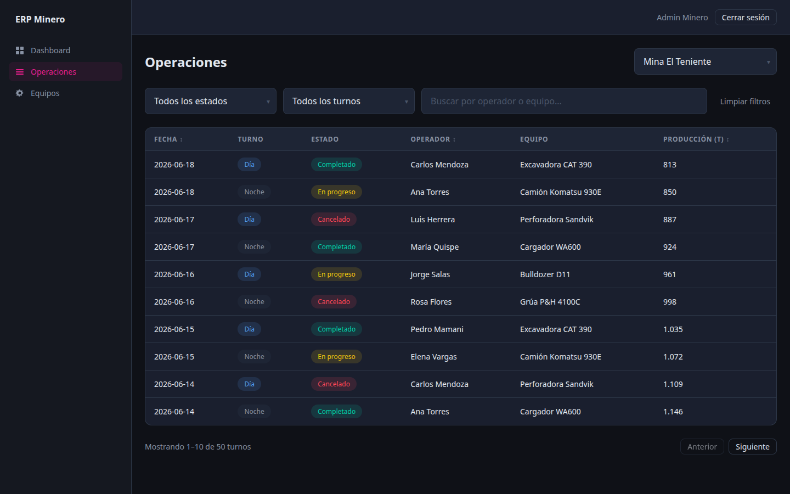
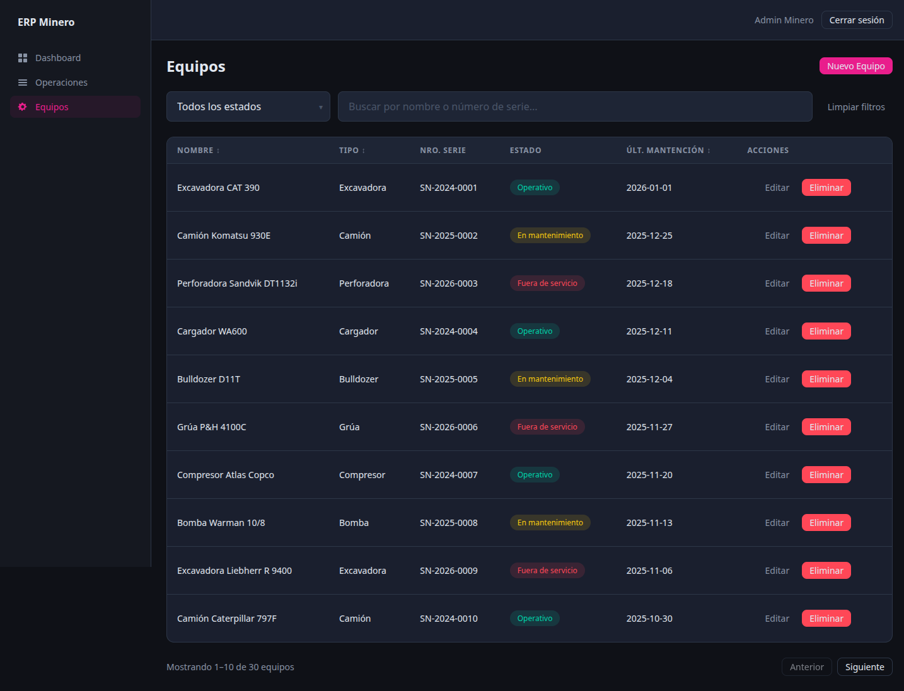
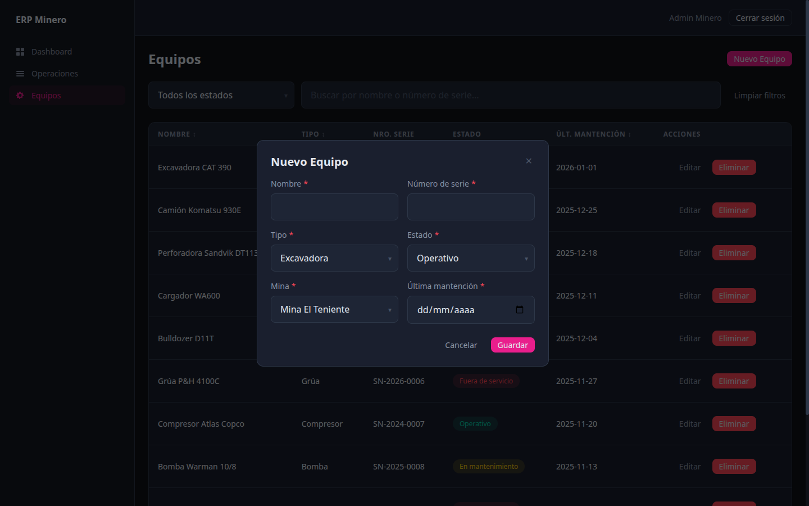

# Demo ERP Minero

> Dashboard de gestión minera con datos reales (MetalpriceAPI + FRED) y operaciones simuladas (MSW). Demo técnico que demuestra experiencia frontend con React, TypeScript y el stack moderno de 2024-2025.

<p>
  
  
  
  
  
</p>

**🔗 Demo en vivo:** [demo-drp-minero.vercel.app](https://demo-drp-minero.vercel.app/)

---

## Vistas de la aplicación

### Landing — presentación y acceso
Página de inicio pública con hero, secciones animadas (features, slider de cotizaciones, métricas y testimonios) y el formulario de login embebido en la zona más visible.



### Dashboard — precios de metales y producción
Tarjetas de cotización en tiempo real (oro, cobre, litio), histórico de precios y comparación producción real vs. objetivo. Selector de mina y de metal.



### Operaciones — tabla de turnos
Tabla paginada con TanStack Table: filtros por estado y tipo de turno, búsqueda por operador o equipo, y badges de estado.



### Equipos — inventario y CRUD
Listado de maquinaria con estado operativo, filtros, búsqueda y altas/ediciones mediante formulario en modal (React Hook Form).



### Alta de equipo — formulario en modal
Formulario validado con React Hook Form para crear y editar maquinaria.



---

## Stack tecnológico

| Pieza | Rol |
|---|---|
| React 19 + TypeScript | Base |
| Vite | Bundler |
| Zustand | Auth state, filtros globales, mina seleccionada |
| TanStack Query v5 | Fetch + cache de APIs y endpoints MSW |
| TanStack Table v8 | Tabla de operaciones y equipos |
| React Hook Form | Login + formulario de equipos |
| Styled Components v6 | Styling completo — solo dark theme |
| Recharts | Gráficos del dashboard |
| MSW v2 | Mock del backend operativo |
| Vitest + RTL | Tests unitarios |
| Playwright | Tests e2e |
| Axios | HTTP client base |

---

## Fuentes de datos

| Fuente | Tipo | Qué provee |
|---|---|---|
| MetalpriceAPI | API real | Precios actuales e históricos de oro, cobre, litio |
| FRED (St. Louis Fed) | API real | Índice de producción minera |
| MSW | Mock de browser | Turnos, equipos e inventario operativo |

> En modo desarrollo, todas las APIs (incluyendo MetalpriceAPI y FRED) son interceptadas por MSW — no se necesitan claves de API válidas para correr el proyecto localmente.

---

## Instrucciones de arranque

**Prerrequisitos:** Node 20+

```bash
# Instalar dependencias
npm install

# Arrancar el servidor de desarrollo
npm run dev
```

La aplicación corre en `http://localhost:5173`.

**Credenciales de acceso (simuladas):**
- Email: `admin@erp.com`
- Contraseña: `password123`

---

## Comandos

```bash
npm run dev          # servidor de desarrollo
npm run build        # build de producción
npm run preview      # previsualizar el build
npm run typecheck    # chequeo de tipos TypeScript
npm run lint         # ESLint
npm test             # Vitest (tests unitarios)
npm run test:watch   # Vitest en modo watch
npm run test:e2e     # Playwright (tests e2e)
```

---

## Arquitectura

**Feature-based** con Atomic Design solo en `shared/components`.

```
src/
├── features/          # auth | dashboard | operations | equipment
│   └── <feature>/
│       ├── components/
│       ├── hooks/        # TanStack Query wrappers
│       ├── services/     # funciones puras HTTP (sin React)
│       ├── store/        # Zustand slices (cuando aplica)
│       └── types/
├── shared/
│   ├── components/
│   │   ├── atoms/        # Button, Input, Badge, Spinner, Label
│   │   ├── molecules/    # FormField, Modal, Dropdown
│   │   └── organisms/    # Sidebar, Header, PageLayout
│   ├── hooks/            # useDebounce, usePagination
│   ├── services/         # apiClient.ts (axios base)
│   ├── mocks/            # MSW handlers
│   └── types/            # ApiResponse<T>, PaginatedResponse<T>
└── app/
    ├── router/           # React Router + ProtectedRoute
    ├── providers/        # QueryClient, ThemeProvider
    └── styles/           # theme.ts, GlobalStyles, styled.d.ts
```

**Tests** en carpeta espejo `tests/` que refleja `src/`.

---

## Decisiones técnicas

**Patrón service → hook → component**
Cada feature separa en tres capas: el service hace la llamada HTTP (función pura, sin React), el hook envuelve el service con TanStack Query o Zustand, y el componente consume el hook sin acceder a la API directamente. Si cambia la API, solo cambia el service.

**MSW en browser**
Toda la capa de mock corre como Service Worker en el browser. Esto permite que los tests e2e con Playwright usen el mismo worker sin configuración extra — lo que ve el test es lo mismo que ve el usuario.

**Solo dark theme**
Sin light mode ni toggle. Todos los valores de color vienen del tema (`theme.colors.*`), nunca hardcodeados.

**Zustand para estado global**
Slices independientes envueltos con el middleware `devtools` (acciones nombradas, trazables en Redux DevTools): `authStore` (usuario autenticado), `mineStore` (mina seleccionada), `equipmentFiltersStore` y `shiftsFiltersStore` (filtros de las tablas).
